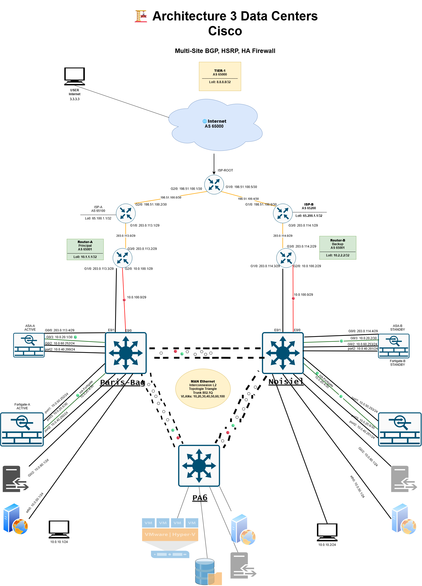

# 📘 Documentation Technique - Infrastructure Multi-Sites Cisco

## 📊 Diagramme d'Architecture



## 🏢 Vue d'ensemble du projet

### Objectif

Déploiement d'une infrastructure réseau hautement disponible sur trois sites géographiques (Paris-Bag, Noisiel, PA6) avec redondance complète des équipements et des liens Internet sur deux sites (Troisieme site en Backup).

### Sites

-   **Site Principal** : Paris-Bag (Production) - Core-A (bag-csr)
-   **Site Secondaire** : Noisiel (DR Principal) - Core-B (noi-csr)
-   **Site Tertiaire** : PA6 (Backup Data) - Core-C (pa6-csr)
-   **Interconnexion** : MAN Ethernet (**Topologie Triangle** - Full Mesh L2)

### Technologies déployées

-   **Routage** : BGP (eBGP + iBGP), AS 65001
-   **Haute Disponibilité** : HSRP CORE/Routeurs, Firewall HA (ASA + FortiGate)
-   **Segmentation** : VLANs (10, 20, 30, 40, 50, 60, 100)
-   **Redondance** : Triple Core Layer (Core-A, Core-B, Core-C)

***

## 

## 

## 

## 

## 

## 

## 🔗 MAN Ethernet - Topologie Triangle

### Architecture Full Mesh Layer 2

```

```

Liens Trunk du Triangle

| Lien                    | Switch 1 | Port 1 | Switch 2 | Port 2 | VLANs autorisés       |
|-------------------------|----------|--------|----------|--------|-----------------------|
| **Paris-Bag ↔ Noisiel** | bag-csr  | E7/1   | noi-csr  | E7/1   | 10,20,30,40,50,60,100 |
| **Paris-Bag ↔ PA6**     | bag-csr  | E7/0   | pa6-csr  | E7/0   | 10,20,30,40,50,60,100 |
| **Noisiel ↔ PA6**       | noi-csr  | E7/2   | pa6-csr  | E7/2   | 10,20,30,40,50,60,100 |

### Configuration des trunks

#### bag-csr (Paris-Bag)

```
interface Ethernet7/0
 description trunk-bag-csr-to-pa6-csr
 switchport trunk allowed vlan 10,20,30,40,50,60,100
 switchport trunk encapsulation dot1q
 switchport mode trunk

interface Ethernet7/1
 description trunk-bag-csr-to-noi-csr
 switchport trunk allowed vlan 10,20,30,40,50,60,100
 switchport trunk encapsulation dot1q
 switchport mode trunk
```

#### noi-csr (Noisiel)

```
interface Ethernet7/1
 description trunk-noi-csr-to-bag-csr
 switchport trunk allowed vlan 10,20,30,40,50,60,100
 switchport trunk encapsulation dot1q
 switchport mode trunk

interface Ethernet7/2
 description trunk-noi-csr-to-pa6-csr
 switchport trunk allowed vlan 10,20,30,40,50,60,100
 switchport trunk encapsulation dot1q
 switchport mode trunk
```

#### pa6-csr (PA6)

```
interface Ethernet7/0
 description trunk-pa6-csr-to-bag-csr
 switchport trunk allowed vlan 10,20,30,40,50,60,100
 switchport trunk encapsulation dot1q
 switchport mode trunk

interface Ethernet7/2
 description trunk-pa6-csr-to-noi-csr
 switchport trunk allowed vlan 10,20,30,40,50,60,100
 switchport trunk encapsulation dot1q
 switchport mode trunk
```

### Avantages de la topologie Triangle

| Aspect          | Bénéfice                                       |
|-----------------|------------------------------------------------|
| **Redondance**  | Si 1 lien tombe, 2 chemins restent disponibles |
| **Performance** | Répartition de charge possible via STP         |
| **Simplicité**  | Pas de boucle L2 avec seulement 3 sites        |
| **Evolutivité** | Ajout d'un 4ème site possible                  |

### Spanning-Tree

**Mode** : PVST (Per-VLAN Spanning Tree)

```
spanning-tree mode pvst
spanning-tree extend system-id
```

[**https://www.cisco.com/c/fr_ca/support/docs/lan-switching/multiple-instance-stp-mistp-8021s/116464-configure-pvst-00.html**](https://www.cisco.com/c/fr_ca/support/docs/lan-switching/multiple-instance-stp-mistp-8021s/116464-configure-pvst-00.html)

**Root Bridge** : bag-csr (priorité la plus basse par défaut)

### Scénario de panne de lien

#### Panne bag-csr ↔ noi-csr

```
Router-A/B (VLAN 10 iBGP)
    ↓
bag-csr E7/0 → pa6-csr E7/2 → noi-csr
    ↑                             ↑
  [Paris-Bag]      [PA6]      [Noisiel]
```

→ Trafic rerouté via PA6 automatiquement (STP reconverge)

***

## 📊 Plan d'adressage IP

### Liens WAN (Internet)

| Lien             | Réseau          | Équipement   | Interface | IP              |
|------------------|-----------------|--------------|-----------|-----------------|
| ISP-ROOT ↔ ISP-A | 198.51.100.0/30 | ISP-ROOT     | G2/0      | 198.51.100.1    |
|                  |                 | ISP-A        | G2/0      | 198.51.100.2    |
| ISP-ROOT ↔ ISP-B | 198.51.100.4/30 | ISP-ROOT     | G1/0      | 198.51.100.5    |
|                  |                 | ISP-B        | G1/0      | 198.51.100.6    |
| ISP-A ↔ Router-A | 203.0.113.0/29  | ISP-A        | G1/0      | 203.0.113.1     |
|                  |                 | Router-A     | G3/0      | 203.0.113.2     |
|                  |                 | **HSRP VIP** | -         | **203.0.113.3** |
| ISP-B ↔ Router-B | 203.0.114.0/29  | ISP-B        | G3/0      | 203.0.114.1     |
|                  |                 | Router-B     | G3/0      | 203.0.114.2     |
|                  |                 | **HSRP VIP** | -         | **203.0.114.3** |

### Interconnexion iBGP (VLAN 10)

| Réseau        | Équipement | Interface | IP         |
|---------------|------------|-----------|------------|
| 10.0.100.0/29 | Router-A   | G2/0      | 10.0.100.1 |
|               | Router-B   | G2/0      | 10.0.100.2 |

### VLANs Internes

| VLAN | Usage           | Réseau       | Gateway (HSRP) |
|------|-----------------|--------------|----------------|
| 10   | iBGP (Routeurs) | 10.0.10.0/24 | 10.0.10.254    |
| 20   | HA Links        | 10.0.20.0/30 | -              |
| 30   | Utilisateurs    | 10.0.30.0/23 | 10.0.30.254    |
| 40   | To-Firewalls    | 10.0.40.0/24 |                |
| 50   | DMZ Privée      | 10.0.50.0/24 |                |
| 60   | DMZ Publique    | 10.0.60.0/24 |                |
| 100  | Management      | -            | -              |

### Loopbacks

| Équipement | Loopback | IP            |
|------------|----------|---------------|
| Router-A   | Lo0      | 10.1.1.1/32   |
| Router-B   | Lo0      | 10.2.2.2/32   |
| Core-A     | Lo0      | 1.1.1.1/32    |
| Core-B     | Lo0      | 2.2.2.2/32    |
| Core-C     | Lo0      | 3.3.3.3/32    |
| ISP-A      | Lo0      | 65.100.1.1/32 |
| ISP-B      | Lo0      | 65.200.1.1/32 |
| ISP-ROOT   | Lo0      | 8.8.8.8/32    |

### Core Switches (HSRP)

**Note** : HSRP configuré uniquement sur VLAN 30 (Users) et VLAN 40 (To-Firewalls). Les autres VLANs (10, 20, 50, 60, 100).

#### Core-A (bag-csr / Paris-Bag) - ACTIVE

| VLAN | IP             | Priorité HSRP | Rôle       |
|------|----------------|---------------|------------|
| 30   | 10.0.30.251/24 | 150           | **Active** |
| 40   | 10.0.40.251/24 | 150           | **Active** |

#### Core-B (noi-csr / Noisiel) - STANDBY

| VLAN | IP             | Priorité HSRP | Rôle        |
|------|----------------|---------------|-------------|
| 30   | 10.0.30.252/24 | 100           | **Standby** |
| 40   | 10.0.40.252/24 | 100           | **Standby** |

#### Core-C (pa6-csr / PA6) - LISTEN

| VLAN | IP             | Priorité HSRP | Rôle       |
|------|----------------|---------------|------------|
| 30   | 10.0.30.253/24 | 50            | **Listen** |
| 40   | 10.0.40.253/24 | 50            | **Listen** |

**Gateway VIP (HSRP)** :

-   VLAN 30 : `10.0.30.254`
-   VLAN 40 : `10.0.40.254`

### Firewalls

#### ASA (Active/Standby)

| Équipement | Interface  | IP             | Rôle    |
|------------|------------|----------------|---------|
| ASA-A      | G0/0 (WAN) | 203.0.113.4/29 |         |
|            | G0/1 (LAN) | 10.0.40.200/24 |         |
|            | G0/2 (DMZ) | 10.0.60.254/24 |         |
|            | HA         | 10.0.20.1/30   | Active  |
| ASA-B      | G0/0 (WAN) | 203.0.113.5/29 |         |
|            | G0/1 (LAN) | 10.0.40.201/24 |         |
|            | G0/2 (DMZ) | 10.0.60.253/24 |         |
|            | HA         | 10.0.20.2/30   | Standby |

#### FortiGate (Active/Standby)

| Équipement  | Interface   | IP             | Rôle    |
|-------------|-------------|----------------|---------|
| FortiGate-A | port2 (LAN) | 10.0.40.250/24 | Active  |
|             | port3 (DMZ) | 10.0.50.254/24 |         |
|             | port4 (HA)  | 10.0.20.5/30   |         |
| FortiGate-B | port2 (LAN) | 10.0.40.251/24 | Standby |
|             | port3 (DMZ) | 10.0.50.253/24 |         |
|             | port4 (HA)  | 10.0.20.6/30   |         |

***

## 🔀 Configuration BGP

### AS Numbers

| Entité                   | AS Number |
|--------------------------|-----------|
| ISP-ROOT                 | 65000     |
| ISP-A                    | 65100     |
| ISP-B                    | 65200     |
| **Notre Infrastructure** | **65001** |

### Peerings BGP

#### Router-A (Principal - Paris-Bag)

-   **Router-ID** : 10.1.1.1
-   **eBGP** : Peering avec ISP-A (AS 65100) via 204.0.113.1
-   **iBGP** : Peering avec Router-B (AS 65001) via 10.0.100.2
    -   Utilise `next-hop-self` pour redistribuer les routes eBGP
-   **Réseaux annoncés** :
    -   203.0.113.0/29 (lien WAN)
    -   10.0.10.0/24 (VLAN 10)
    -   10.0.30.0/23 (VLAN 30 - agrégation)
-   **Rôle** : Route principale (préférée) pour le trafic sortant

#### Router-B (Backup - Noisiel)

-   **Router-ID** : 10.2.2.2
-   **eBGP** : Peering avec ISP-B (AS 65200) via 204.0.114.1
-   **iBGP** : Peering avec Router-A (AS 65001) via 10.0.100.1
    -   Utilise `next-hop-self` pour redistribuer les routes eBGP
-   **Réseaux annoncés** :
    -   203.0.114.0/29 (lien WAN)
    -   10.0.10.0/24 (VLAN 10)
    -   10.0.30.0/23 (VLAN 30 - agrégation)
-   **AS-PATH Prepending** : 3x 65001 vers ISP-B (route moins préférée)
-   **Local Preference** : 50 (vs 200 sur Router-A)
-   **Rôle** : Route de secours (backup)

### Stratégie de routage

| Direction               | Route préférée      | Mécanisme                    |
|-------------------------|---------------------|------------------------------|
| **Sortant (Internet)**  | Router-A → ISP-A    | Local Preference (200 vs 50) |
| **Entrant (vers nous)** | ISP-A → Router-A    | AS-PATH (plus court)         |
| **Failover**            | Automatique via BGP | Convergence \~4min30s        |

***

## 🔄 Haute Disponibilité (HA)

### HSRP Configuration / Core Switches (VLANs Internes)

**Exemple VLAN 30 (Users)**

```
! Core-A (Active)
interface Vlan30
 ip address 10.0.30.2 255.255.255.0
 standby 30 ip 10.0.30.254
 standby 30 priority 150
 standby 30 preempt

! Core-B (Standby)
interface Vlan30
 ip address 10.0.30.3 255.255.255.0
 standby 30 ip 10.0.30.254
 standby 30 priority 100
 standby 30 preempt

! Core-C (Listen)
interface Vlan30
 ip address 10.0.30.4 255.255.255.0
 standby 30 ip 10.0.30.254
 standby 30 priority 50
 standby 30 preempt
```

### Firewall HA

#### ASA (Active/Standby)

-   **Liaison HA** : G0/4
-   **Mode** : Active/Standby avec state replication
-   **Failover** : Automatique (sub-second)
-   **IP Failover** : 10.0.20.1/30 ↔ 10.0.20.2/30

#### FortiGate (Active-Passive)

```
config system ha
 set group-name "forti"
 set mode a-p
 set hbdev "port4" 0
 set override disable
 set unicast-hb enable
 set unicast-hb-peerip 10.0.20.6    ! FortiGate-B
end
```

***

## 🌊 Flux de Trafic

### Trafic Utilisateurs → Internet (Normal)

```
User (10.0.30.x)
    ↓
Core-A (HSRP Active) - 10.0.30.254
    ↓
ASA-A (Sécurité + NAT)
    ↓
Router-A (203.0.113.3)
    ↓
ISP-A → Internet
```

### Trafic Internet → Serveurs Web

```
Internet
    ↓
ISP-A → Router-A
    ↓
ASA-A (NAT 203.0.113.5 vers 10.0.60.1 + ACL +IPS*)
    ↓ (Port 80/443) 
Reverse Proxy (10.0.60.1)
    ↓ (ProxyRevers 10.0.50.1)
FortiGate-A (IPS+Antivirus)
    ↓
Serveur Web (10.0.50.1)

*Si activation IPS
```

### Scénario Failover (Router-A down)

```
User (10.0.30.x)
    ↓
Core-A (HSRP Active) - 10.0.30.254
    ↓
ASA-A
    ↓
[X] Router-A DOWN
    ↓
iBGP converge (4min30s)
    ↓
Router-B (203.0.114.3)
    ↓
ISP-B → Internet
```

***

## ✅ Résultats des Tests

### Test 1 : Failover Serveurs (Paris-Bag → Noisiel)

-   **Action** : Extinction de tous les serveurs site Paris-Bag
-   **Résultat** : ✅ **Bascule instantanée**
-   **Mécanisme** : HSRP Core-A → Core-B
-   **Impact utilisateur** : Aucun (transparent)

### Test 2 : Failover Lien Internet (Router-A down)

-   **Action** : Extinction Router-A
-   **Résultat** : ✅ **Bascule en 4min30s**
-   **Mécanisme** :
    -   BGP Hold Timer (180s) = 3min
    -   Convergence BGP + propagation = \~90s
-   **Impact utilisateur** : Perte de connexion Internet pendant 4min30s

### Test 3 : Disaster Recovery Complet (Site Paris-Bag)

-   **Action** : Extinction totale du site Paris-Bag :
    -   Router-A
    -   ASA-A
    -   FortiGate-A
    -   Core-A (bag-csr)
    -   Tous les serveurs
    -   PC utilisateurs
-   **Résultat** : ✅ **RTO = 4min30s**
-   **Détails** :
    -   HSRP Core : **Instantané** (bag-csr → noi-csr)
    -   Firewall HA : **Instantané** (Forti-A → Forti-B / ASA-A → ASA-B)
    -   BGP Failover : **4min30s** (Router-A → Router-B)
    -   Serveurs : Démarrage manuel sur Noisiel
    -   **MAN Triangle** : Trafic rerouté via noi-csr ↔ pa6-csr

### Test 4 : Résilience MAN (à documenter si testé)

-   **Scénario** : Panne d'un lien trunk du triangle
-   **Attendu** : STP reconverge, trafic rerouté via les 2 autres chemins
-   **Impact** : Transparent (quelques secondes max)

### Test 5 : Site PA6 (Backup Data)

-   **Rôle** : Core-C en mode LISTEN (priorité 50)
-   **Utilisation** :
    -   Backup storage (serveurs non actifs par défaut)
    -   Bascule HSRP uniquement si bag-csr ET noi-csr down
-   **Statut** : ✅ Testé et fonctionnel (HSRP Listen)

***

## 🔧 Procédures d'Exploitation

### Vérification de l'état HSRP

```bash
# Sur Core-A/B/C
show standby brief
show standby vlan 30

# Vérifier les priorités et l'état Active/Standby
```

### Vérification BGP

```bash
# Sur Router-Root
show bgp (Vérifier la route jusqu’à la cible)
```

### Vérification Firewall HA

```bash
# ASA
show failover
show failover state
# FortiGate
get system ha status
diagnose sys ha status
```

### Forcer un failover manuel

#### HSRP

```bash
# Réduire la priorité sur le routeur actif
interface GigabitEthernet1/0
 standby 1 priority 50
```

#### ASA

```bash
# Sur l'ASA actif
failover active
```

#### FortiGate

```bash
# Sur le FortiGate actif
execute ha manage 1 admin    # Se connecter au standby
diagnose sys ha reset-uptime
```

***

## 🛡️ Sécurité

### ASA - Zones et Niveaux

| Interface | Zone    | Security Level |
|-----------|---------|----------------|
| G0/0      | wan-1   | 0 (Untrusted)  |
| G0/1      | lan     | 100 (Trusted)  |
| G0/2      | lan-dmz | 50 (DMZ)       |

***

## 📞 Contacts et Escalade

| Rôle             | Contact           | Niveau          |
|------------------|-------------------|-----------------|
| Admin Réseau     | Rizqui Redouane   | L1              |
| Ingénieur Senior | Rizqui Redouane   | L2              |
| Architecte       | Rizqui Redouane   | L3              |
| TAC Cisco        | +33 X XX XX XX XX | Support éditeur |

***

## 📎 Annexes

### A. Schéma détaillé

Voir fichier `design.xml` (Draw.io)

### B. Configurations complètes

-   **Routeurs BGP** :
    -   Router-A : `Router-A.txt`
    -   Router-B : `Router-B.txt`
    -   ISP-A : `ISP-A.txt`
    -   ISP-B : `ISP-B.txt`
    -   ISP-ROOT : `ISP-ROOT.txt`
-   **Core Switches (MAN Triangle)** :
    -   Core-A (bag-csr / Paris-Bag) : `csr-bag.txt`
    -   Core-B (noi-csr / Noisiel) : `csr-noi.txt`
    -   Core-C (pa6-csr / PA6) : `csr-pa6.txt`
-   **Firewalls** :
    -   ASA : `running-config ASA.cfg`
    -   FortiGate-bag : `FortiGate-bag_20251104_1727.conf`
-   **Schéma** :
    -   Topologie complète : `design.xml` (Draw.io)

### C. Commandes de dépannage

```bash
# Traces BGP
debug ip bgp updates
debug ip bgp keepalives

# Traces HSRP
debug standby events
debug standby packets

# Vérification Spanning-Tree (MAN Triangle)
show spanning-tree vlan 10
show spanning-tree summary
show spanning-tree root

# Vérification des trunks
show interfaces trunk
show interfaces Ethernet7/0 switchport
show vlan brief

# Captures réseau
monitor capture CAP interface GigabitEthernet3/0 both
monitor capture CAP start

# Test connectivité MAN
! Depuis bag-csr
ping 10.0.30.252    # vers noi-csr
ping 10.0.30.253    # vers pa6-csr

! Test iBGP via VLAN 10
ping 10.0.100.2     # Router-B depuis Router-A
```

***

## 📅 Historique des modifications

| Date       | Version | Auteur          | Modifications                |
|------------|---------|-----------------|------------------------------|
| 2025-11-05 | 1.0     | Rizqui Redouane | Version initiale après tests |

***

**🎯 Statut actuel : Production - Infrastructure validée et fonctionnelle**
